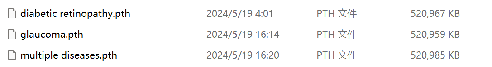
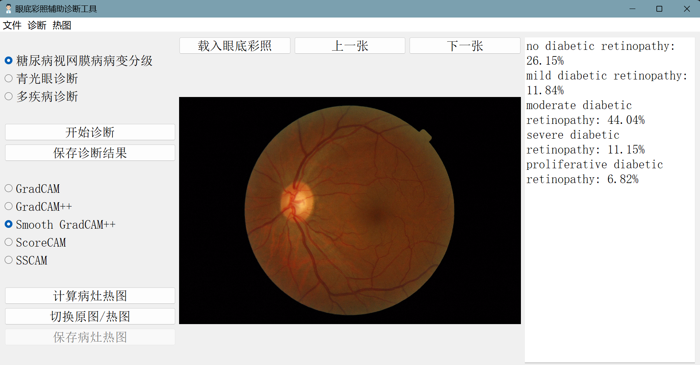
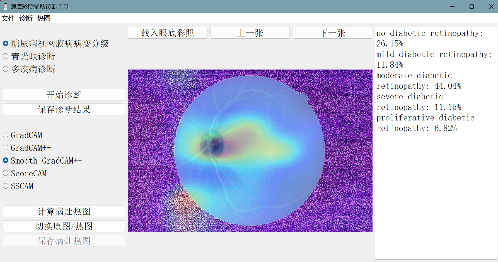
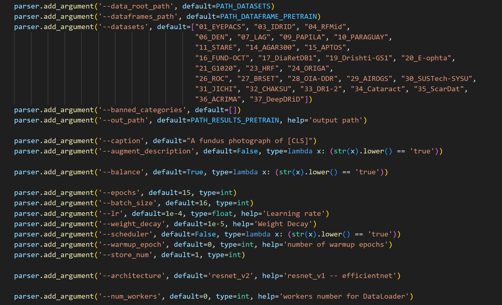
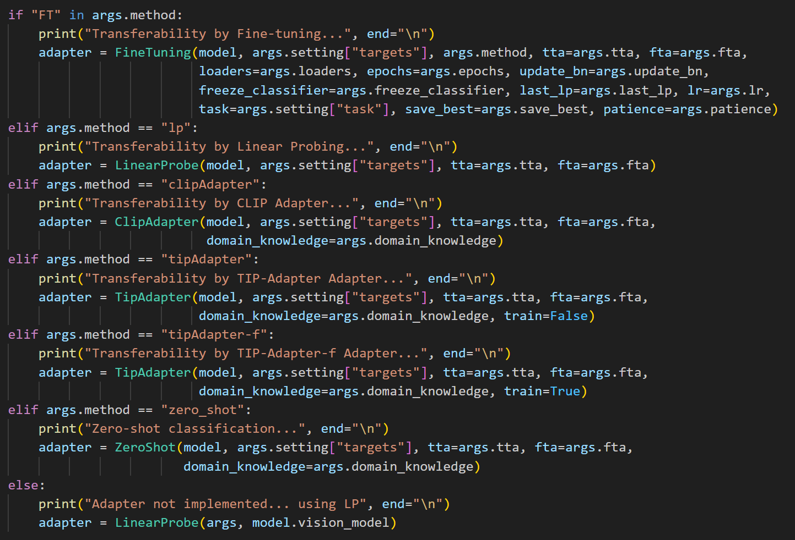

# 眼底图像辅助诊断系统使用说明
## 一、系统介绍
### 1. 文件说明
```
├─Bio_ClinicalBERT  //用来存放模型文本编码器预训练好的参数
├─checkpoint    //用来存放模型+分类器预训练好的参数
├─local_data    //用来存放实验预设
├─model //模型
│  ├─modeling
│  ├─pretraining
│  │  └─data
│  ├─transferability
│  │  ├─data
│  │  └─modeling
│  └─utils
├─测试图片  //用来存放载入的测试图片
├─热图  //用来存放计算完成的热图
├─诊断结果  //用来存放诊断结果文本
└─说明文档
└─图标.png
└─UI.py //图形界面代码
└─diagnose.py   //诊断部分代码
└─heatmap.py    //生成热图部分代码
└─pretrain.py   //模型预训练代码
└─transfer.py   //模型迁移代码
```

Bio_ClinicalBERT从<https://huggingface.co/emilyalsentzer/Bio_ClinicalBERT>下载。

|模型+分类器预训练参数文件|功能|Linear Probing数据集|数据集样本个数|类别|
|---|---|---|---|---|
|diabetic retinopathy.pth|糖尿病视网膜病病变分级|EYEPACS|88702|5种：no diabetic retinopathy, mild diabetic retinopathy, moderate diabetic retinopathy, severe diabetic retinopathy, proliferative diabetic retinopathy|
|glaucoma.pth|青光眼诊断|AIROGS|101442|2种：no glaucoma, glaucoma|
|multiple diseases.pth|多疾病诊断|JICHI|22186（处理后）|14种：no diabetic retinopathy, microaneurysm, retinal hemorrhage, hard exudate, retinal edema, more than three small soft exudates, neovascularization, preretinal haemorrhage, fibrovascular proliferativemembrane, tractionalretinaldetachment, soft exudate, varicose veins, intraretinal microvascular abnormality, non-perfusion area over one disc area|


### 2.交互界面
系统可以选择三种不同的功能进行诊断，每种诊断都会加载相对应的预训练参数文件进行处理，诊断后结果会显示在右侧的文本框内，可以进行修改。

计算病灶热图可以选择GradCAM、GradCAM++、Smooth GradCAM++、ScoreCAM、SSCAM五种不同的方法。计算热图可能需要等待2-3分钟。点击“切换原图/热图”按钮可以切换查看原图和热图。


## 二、环境配置
软件所需Python版本为3.8或以上。
1. 按照requirements.txt中的内容安装包
```
pip install -r requirements.txt -i https://pypi.tuna.tsinghua.edu.cn/simple some-package
```
2. 安装torchcam（用来计算热图）
```
pip install torcham -i https://pypi.tuna.tsinghua.edu.cn/simple some-package
```
3. 因为安装torchcam的过程中会将torch包卸载更新为2.3.0版本，相对应的torchvision包需要手动更新为对应的0.18.0版本
```
pip install torchvision==0.18.0 -i https://pypi.tuna.tsinghua.edu.cn/simple some-package
```
4. 安装PyQt5（用来显示图形界面）
```
pip install PyQt5 -i https://pypi.tuna.tsinghua.edu.cn/simple some-package
```

## 三、模型预训练
使用pretrain.py中的代码可以对模型进行预训练。

修改参数以改变实验设置。


## 四、模型迁移
使用transfer.py中的代码可以将预训练模型迁移到下游分类任务数据集上。

迁移方法可选择fine-tune、Linear Probing、ClipAdapter、TipAdapter、TipAdapter-f、zero-shot。


在迁移过程中训练得到的模型参数在载入时需加入相应的分类器，例如，使用Linear Probing将预训练模型迁移到下游数据集，在载入模型时需要加入一个线性层作为分类器。
```
model = Model(vision_type='resnet_v2', bert_type='./Bio_ClinicalBERT', from_checkpoint=False, vision_pretrained=True)
model.classifier = torch.nn.Linear(512, 5, bias=True)
model.load_from_pretrained(weights_path)
```